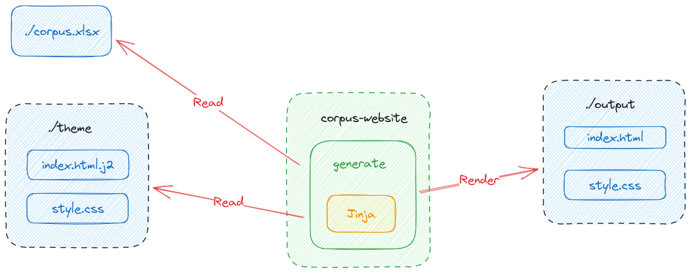

# `corpus-website`

## Requirements

First, install `python` and `pdm`and then run `pdm install`. 

## How to us it?

Serve locally an Excel file: `pdm run corpus-website serve "./path/to/excel/file.xlsx" "./path/to/theme/folder"`

Render website: `pdm run corpus-website render "./path/to/excel/file.xlsx" "./path/to/theme/folder" "./output/folder"`

Deploy website: `TODO`

## How does it work?

